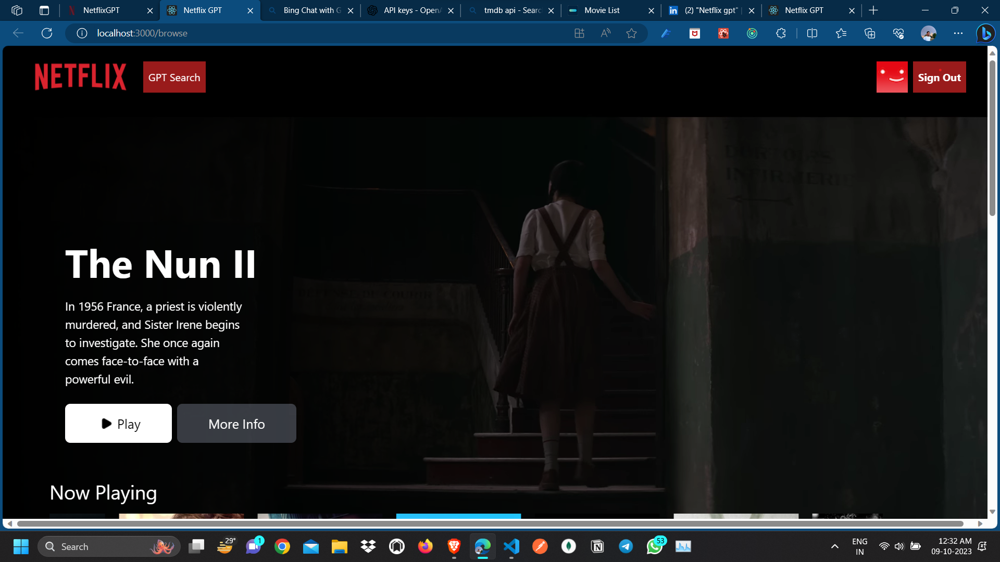

# Netflix Clone with Advanced GPT-Based Searching

## Overview

This project is a Netflix clone that replicates the popular streaming platform's user interface and incorporates advanced search functionality powered by GPT (Generative Pre-trained Transformer). It's built using modern web technologies, including React, Redux, and Tailwind CSS.

## Features

- User-friendly Netflix-like interface.
- Advanced search using GPT-based natural language processing.
- Responsive design for various screen sizes.
- Seamless video playback integration.
- User authentication (if applicable).

## Technologies Used

- **React**: JavaScript library for building the user interface.
- **Redux**: State management for predictable data flow.
- **Tailwind CSS**: Utility-first CSS framework for styling.
- **GPT (Generative Pre-trained Transformer)**: Advanced search functionality.

## Getting Started

### Prerequisites

- Node.js and npm (Node Package Manager) installed on your machine.
- Clone this repository to your local machine.

### Installation

1. Clone this repository to your local machine using Git:  
   git clone `https://github.com/subhajit033/netflix-gpt.git`
2. Navigate to the project directory:
   `cd netflix-gpt`
3. Install project dependencies using npm:
   `npm install`
4. Run development server
   `npm run start`
